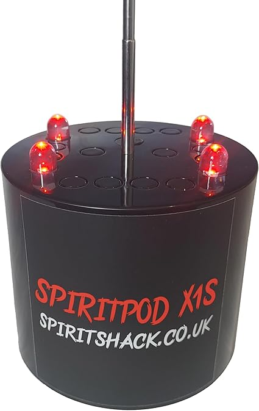

# SpiritPod

## What is a SpritPod ?
The SpiritPod is a device used by ghost hunters to detect ghosts, spirits, and demons. 😈👻

## How does it work ?
It's like an EMF detector (https://github.com/HaneiNeko/EMF-Detector 🙃), the SpiritPod work with a antenna, if an electromagetics field touch the antenna, a LED will be turn ON, and a beep from a buzzer will be heard.

## This project
This project use the Arduino framework.

## Usage
1. Use the schematic for create the PCB
2. Push the code into the microcontroller
3. Print the case (optional)
4. Enjoy ! 👻😉

## Real SpiritPod
